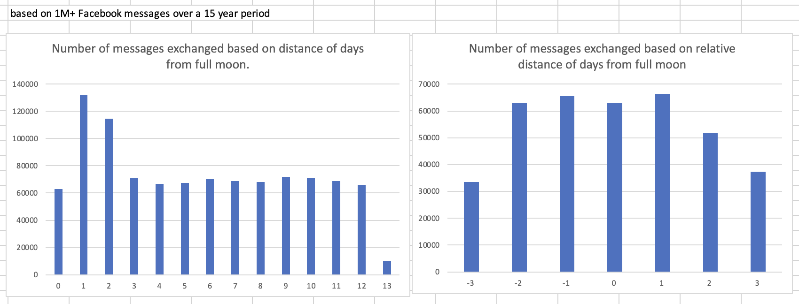

# Exploring sensitivity to full moons through Facebook message activity
Python code to explore the increase in the number of Facebook messages exchanged during full moons.

This code makes use of the Full Moon Calendar 1900-2050 found on Kaggle: https://www.kaggle.com/datasets/lsind18/full-moon-calendar-1900-2050

Steps:
1. Request all-time message history from facebook (low image quality is enough, only the .json files are needed)
2. Depending on your past facebook activity, multiple folders will be available for download. Find the one where the JSON files are located and execute the rest of the steps in that particular one
3. Run the json_keeper.py then the json_mover.py to collect all JSON files into the top-level folder. Delete all subfolders and non-JSON files.
4. Run read-absolute-distance.py to get a frequency dict with the number of messages sent before or after the closest full moon by X days.
5. Run read-relative-distance.py to get a frequency dict with the number of messages sent around the closest full moons for each message (+/- 3 days)

